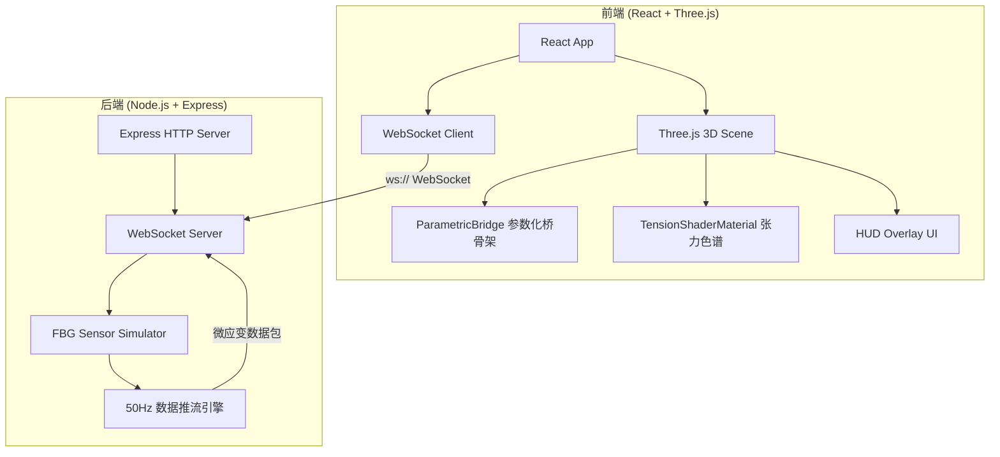

## 1. 架构设计



## 2. 技术说明

- **前端**：React@18 + Three.js + TailwindCSS@3 + Vite
- **初始化工具**：vite-init（react-express-ts 模板）
- **后端**：Express@4 + ws（WebSocket 库）
- **数据库**：无（实时流式数据，不持久化）
- **3D 渲染**：Three.js 原生 API（CatmullRomCurve3、TubeGeometry、ShaderMaterial）
- **状态管理**：Zustand

## 3. 路由定义

| 路由 | 用途 |
|------|------|
| `/` | 数字孪生主控台（唯一页面） |

## 4. API 定义

### 4.1 WebSocket 消息协议

**客户端 → 服务端**

```typescript
interface WSClientMessage {
  type: "subscribe" | "unsubscribe" | "set_frequency";
  sensorIds?: string[];
  frequency?: number;
}
```

**服务端 → 客户端**

```typescript
interface WSSensorPayload {
  type: "sensor_data";
  timestamp: number;
  sensors: {
    id: string;
    microStrain: number;
    tensionRatio: number;
  }[];
}

interface WSStatusPayload {
  type: "status";
  connected: boolean;
  frequency: number;
  activeSensors: number;
}
```

### 4.2 HTTP API

| 方法 | 路径 | 用途 |
|------|------|------|
| GET | `/api/bridge/config` | 获取桥梁工程参数（跨度、塔高、垂度等） |
| GET | `/api/sensors` | 获取传感器列表与状态 |

```typescript
interface BridgeConfig {
  span: number;
  towerHeight: number;
  sag: number;
  catenaryParam: number;
  deckWidth: number;
  suspenderCount: number;
  suspenderPositions: { x: number; y_cable: number; y_deck: number; length: number }[];
}

interface SensorInfo {
  id: string;
  suspenderIndex: number;
  position: { x: number; y: number; z: number };
  alertThreshold: number;
  currentMicroStrain: number;
}
```

## 5. 服务端架构图

```mermaid
graph LR
    "Express Router" --> "Bridge Config Service"
    "Express Router" --> "Sensor Registry"
    "WebSocket Handler" --> "FBG Simulator"
    "FBG Simulator" --> "Data Broadcaster"
    "Data Broadcaster" --> "WebSocket Clients"
```

## 6. 核心算法

### 6.1 悬链线方程

```
y(x) = a * cosh(x / a) - a
其中 a = T_H / w（水平张力 / 均布自重荷载）
```

根据跨径 L 与中点垂度 f 反算：
```
f = a * (cosh(L / (2a)) - 1)
→ 迭代求解 a
```

### 6.2 吊索长度计算

```
吊索位置 x_i 处：
y_cable(x_i) = a * cosh(x_i / a) - a
吊索长度 L_i = y_cable(x_i) - y_deck
```

### 6.3 FBG 微应变模拟

```
基线微应变: ε₀ = 800 με
动态叠加: ε(t) = ε₀ + A * sin(2πf₁t) + B * sin(2πf₂t) + noise
其中 A, B 为振幅，f₁, f₂ 为低频振动频率，noise 为高斯白噪声
张力比: ratio = clamp((ε - ε_safe) / (ε_alert - ε_safe), 0, 1)
```

### 6.4 ShaderMaterial 张力色谱

```glsl
// 片元着色器核心逻辑
uniform float uTensionRatio;
varying float vHeight;

void main() {
  vec3 safeColor = vec3(0.0, 1.0, 0.53);   // 冷绿
  vec3 warnColor = vec3(1.0, 0.85, 0.0);   // 黄
  vec3 alertColor = vec3(1.0, 0.2, 0.27);  // 亮红

  vec3 color;
  float r = uTensionRatio;
  if (r < 0.5) {
    color = mix(safeColor, warnColor, r * 2.0);
  } else {
    color = mix(warnColor, alertColor, (r - 0.5) * 2.0);
  }

  // 预警脉冲
  float pulse = 1.0 + 0.15 * sin(uTime * 4.0) * step(0.6, r);
  gl_FragColor = vec4(color * pulse, 1.0);
}
```
